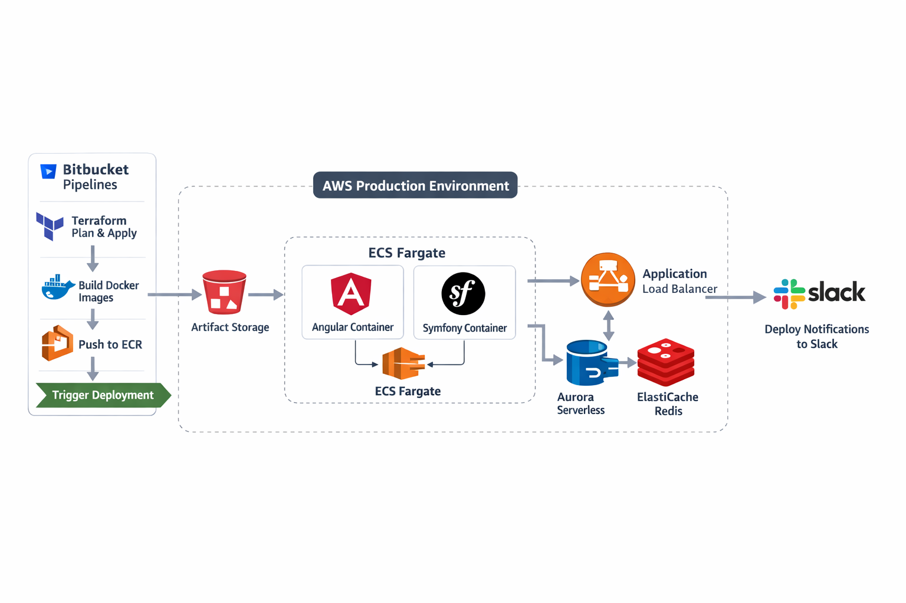
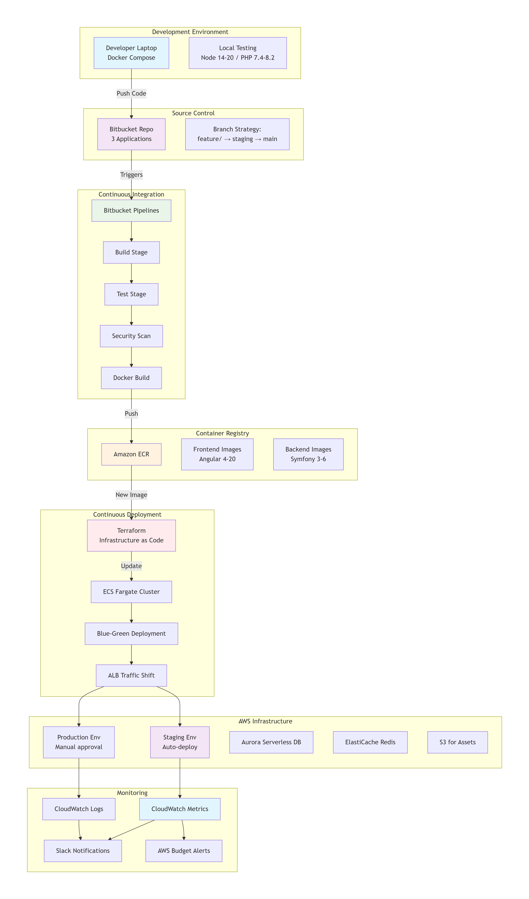
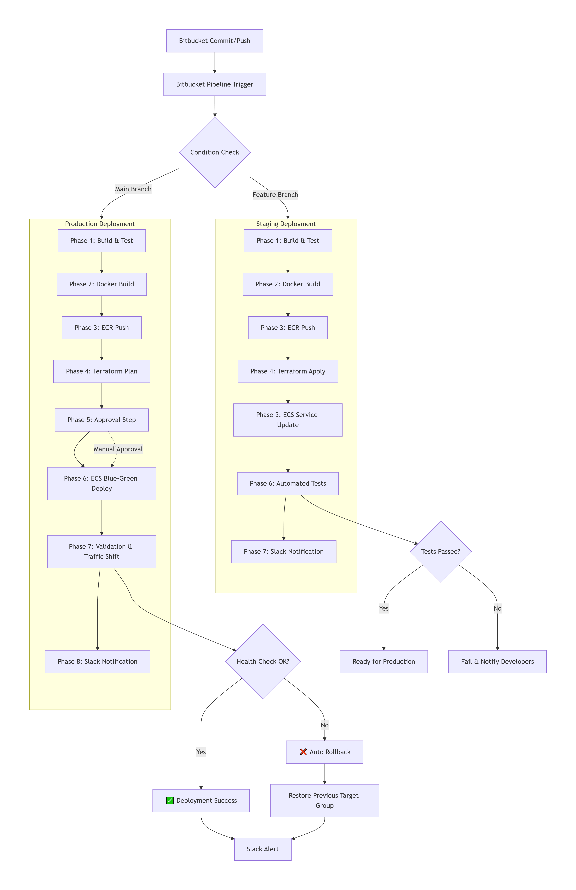

# AWS Infrastructure Modernization and Migration Plan

## 1. Executive Summary

This document outlines a recommended modernization of the existing AWS infrastructure to improve **deployment speed** , **operational simplicity** , **reliability** , and **cost efficiency** .

The proposed target architecture is based on **container orchestration with Amazon ECS (Fargate)** , **Infrastructure as Code using Terraform** , and **CI/CD via Bitbucket Pipelines** , while preserving the existing legacy environments unchanged.

Key business goals addressed:

- Enable **daily or on-demand releases** with minimal risk
- Reduce AWS monthly cost from **~$2,500 to < $1,200** (including database)
- Support **parallel frontend and backend migrations**
- Ensure **zero-downtime production deployments**
- Improve observability, security, and scalability

---

## 2. Current Infrastructure Assessment (AS-IS)

### 2.1 Architecture Overview

- Multiple AWS accounts (Legacy Production / Legacy Staging+Dev)
- EC2-based workloads with custom blue-green logic
- Jenkins-driven deployments
- Docker used without orchestration
- Aurora MySQL (Writer + Reader)
- Redis via ElastiCache
- Cloudflare in front of ALB

### 2.2 Key Limitations

#### Operational Complexity

- Manual scaling and deployment steps
- Custom blue-green logic based on EC2 lifecycle
- High deployment risk and slow rollback

#### Cost Inefficiency

- Aurora I/O and storage costs are excessively high
- NAT Gateway runs 24/7
- Underutilized EC2 instances
- CloudWatch log retention > 1.4 TB

#### Limited Scalability

- Scaling at instance level only
- No application-level autoscaling

#### CI/CD Constraints

- Jenkins maintenance overhead
- No native IAM or Terraform state integration

---

## 3. Target Architecture (TO-BE)

### 3.1 Design Principles

- Infrastructure as Code (Terraform)
- Immutable deployments
- Managed services over self-managed EC2
- Separation of frontend and backend lifecycles
- Cost-aware, pay-per-use model

For detailed Terraform module structure, see: [Terraform Infrastructure Structure](terraform-structure.md)

### 3.2 Compute Layer

**Amazon ECS with Fargate**

- No EC2 management
- Per-task billing
- Native autoscaling
- Built-in blue-green deployment with ALB

> EKS was evaluated but rejected due to higher operational overhead.

### 3.3 Networking

- Dedicated VPC per environment
- Public subnets: ALB
- Private subnets: ECS tasks, RDS, Redis
- Minimized NAT Gateway usage

### 3.4 Load Balancing

- Application Load Balancer
- Path-based routing:
  - `/api/*` → Symfony API
  - `/` → Angular apps

### 3.5 Database

- Aurora MySQL Serverless v2 (if compatible)
- Automated backups + Point-In-Time Recovery
- Snapshot-based cloning for migration environments

### 3.6 CI/CD

**Bitbucket Pipelines**

Pipeline stages:

1. Build & Test
2. Docker Image Build
3. Push to Amazon ECR
4. Terraform Plan
5. Terraform Apply
6. ECS Blue-Green Deployment

For detailed Bitbucket Pipelines configuration, see: [Bitbucket Pipelines YAML](bitbucket-pipelines.yaml)

### 3.7 Observability & Notifications

- CloudWatch Logs with 30–90 day retention
- CloudWatch Alarms
- AWS Budgets
- Slack notifications via SNS

---

## 4. Environment Strategy

| Purpose   | Environments                         |
| --------- | ------------------------------------ |
| Legacy    | Existing EC2-based infra (unchanged) |
| Migration | New ECS-based Staging + Production   |

- Frontend and Backend deployed independently
- Only one migration track active at a time
- Rollback via ALB target group switch

For detailed production architecture documentation, see: [Production Architecture Overview](production-architecture.md)

---

## 5. Migration Plan & Timeline

### Phase 0 – Preparation (24 hours)

| Task                              | Hours |
| --------------------------------- | ----- |
| New AWS accounts setup            | 4     |
| IAM & access model                | 4     |
| Terraform backend (S3 + DynamoDB) | 4     |
| Base networking modules           | 8     |
| ECR repositories                  | 4     |

---

### Phase 1 – Core Platform (32 hours)

| Task                 | Hours |
| -------------------- | ----- |
| ECS Fargate cluster  | 6     |
| ALB + target groups  | 6     |
| Autoscaling policies | 4     |
| Logging & retention  | 4     |
| Slack notifications  | 4     |
| Security hardening   | 8     |

---

### Phase 2 – Database Migration Setup (24 hours)

| Task                         | Hours |
| ---------------------------- | ----- |
| Aurora Serverless evaluation | 4     |
| Snapshot copy from legacy    | 6     |
| Parallel DB restore          | 6     |
| Connectivity tests           | 4     |
| Backup & PITR validation     | 4     |

---

### Phase 3 – Backend (Symfony) Migration (40 hours)

| Task                         | Hours |
| ---------------------------- | ----- |
| Dockerfile modernization     | 6     |
| PHP / Composer upgrades      | 6     |
| ECS task definitions         | 6     |
| CI/CD pipeline               | 6     |
| Staging deploy & test        | 8     |
| Production blue-green deploy | 8     |

---

### Phase 4 – Frontend (Angular) Migration (32 hours)

| Task                                    | Hours |
| --------------------------------------- | ----- |
| Multi-version Node/Angular Docker setup | 6     |
| Build optimization                      | 4     |
| ECS services                            | 6     |
| CI/CD pipeline                          | 6     |
| Staging validation                      | 6     |
| Production deploy                       | 4     |

---

### Phase 5 – Legacy Decommissioning (16 hours)

| Task                     | Hours |
| ------------------------ | ----- |
| Traffic cutover          | 2     |
| Jenkins shutdown         | 4     |
| Legacy EC2 scale-down    | 4     |
| Cost validation          | 4     |
| Documentation & handover | 2     |

---

**Total Estimated Effort: 168 hours**

---

## 6. Cost Comparison (WAS vs BECOMES)

| Area       | Current       | New                     |
| ---------- | ------------- | ----------------------- |
| Compute    | EC2 always-on | ECS Fargate (on-demand) |
| Deployment | Manual EC2    | Native blue-green       |
| Database   | Fixed Aurora  | Serverless Aurora       |
| Logs       | Unlimited     | Controlled retention    |
| NAT        | Always-on     | Optimized               |

**Expected monthly cost:** $970–$1,200

For detailed cost breakdown and analysis, see: [Cost Analysis Before vs After](cost-breakdown.md)

---

## 7. Key Benefits

### Speed

- Deployments in minutes
- Parallel frontend/backend releases
- Fast rollbacks

### Convenience

- No server management
- Fully automated pipelines
- Simple environment cloning

### Cost

- Pay only for running workloads
- Lower RDS and NAT costs
- Predictable billing

---

## 8. Conclusion

The proposed architecture modernizes the platform while minimizing risk, enabling faster delivery, reducing cost, and simplifying long-term operations.

Legacy environments remain untouched, ensuring safe migration and rollback at every stage.
